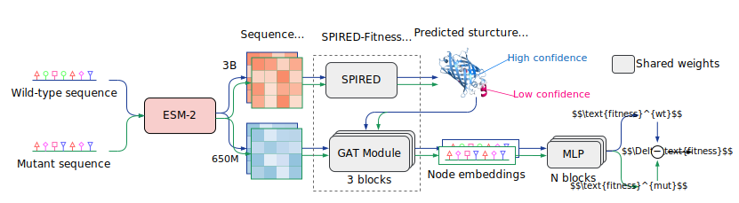

# Evaluation of the Fitness Predictor
To verify the reliability of the fitness predictor (reward model) in RelaVDEP, we evaluated it on the ProteinGym benchmark.

## Overview
For the reward model, the Structure Prediction Module (SPIRED) and the Graph Attention Mechanism Module (GAT Module) adopt the pre-trained parameters of SPIRED-Fitness. To accommodate mutation data of varying scales, multi-layer MLP modules are used for fine-tuning. The model processes both the wild-type and mutant sequences using shared weights, and a final linear layer calculates the fitness change by taking the difference between their outputs.



## Data Access

### Reference file

The [reference file](https://github.com/OATML-Markslab/ProteinGym/blob/main/reference_files/DMS_substitutions.csv) of DMS substitutions can be downloaded from the ProteinGym repository and be saved as `DMS_substitutions.csv` in `data/` directory.

The file can be downloaded by running the following:

```
curl -o data/DMS_substitutions.csv https://raw.githubusercontent.com/OATML-Markslab/ProteinGym/main/reference_files/DMS_substitutions.csv
```

### DMS assays
All DMS assays can be downloaded and extracted to `data/cv_splits` directory. Run the following to download and extract all assays:

```
# Download single-mutant and multiple-mutant assays
curl -o cv_folds_singles_substitutions.zip https://marks.hms.harvard.edu/proteingym/ProteinGym_v1.3/cv_folds_singles_substitutions.zip
curl -o cv_folds_multiples_substitutions.zip https://marks.hms.harvard.edu/proteingym/ProteinGym_v1.3/cv_folds_multiples_substitutions.zip

# Unpack and remove zip archive
unzip cv_folds_singles_substitutions.zip -d data/cv_splits
rm cv_folds_singles_substitutions.zip
unzip cv_folds_multiples_substitutions.zip -d data/cv_splits
rm cv_folds_multiples_substitutions.zip
```

## Usage

### Step 1: Extract sequence embeddings

All sequence embeddings of ProteinGym DMS assays (`embeddings.zip`) can be downloaded from [Zenodo](https://doi.org/10.5281/zenodo.17590929). The full zip archive takes up approximately 34.2GB of storage.

Alternatively, you can extract embeddings for the specific assay data via:

```
python 1_extract_embeddings.py \ 
    cv_splits=multiples
    cv_scheme=fold_rand_multiples
```

### Step 2: Evaluation on ProteinGym Benchmark
To evaluate the fitness predictor on the full benchmark, run the following:

```
python 2_proteingym_benchmark.py --multirun \ 
    cv_splits=singles
    cv_scheme=fold_random_5,fold_modulo_5,fold_contiguous_5
```

To evaluate a single dataset from the ProteinGym assays (e.g., `GFP_AEQVI_Sarkisyan_2016`), run the following:
```
python 2_proteingym_benchmark.py \
    cv_splits=multiples
    cv_scheme=fold_rand_multiples
    dataset=single
    single_id=GFP_AEQVI_Sarkisyan_2016
```

All commands in step 1 and step 2 can refer to the following explanations:

- `cv_splits`: Determines the data splits used for supervised cross-validation. Must be one of the following:
    * `singles`: Only utilizes single mutants (variants with only one mutation).
    * `multiples`: Utilizes all mutants in the dataset (including variants with multiple mutations).

- `cv_scheme`: Defines the method used for generating cross-validation folds.
    * If `cv_splits` is set to `singles`, it must be chosen from [`fold_random_5`, `fold_modulo_5`, `fold_contiguous_5`]
    * If `cv_splits` is set to `multiples`, it must be `fold_rand_multiples`.
